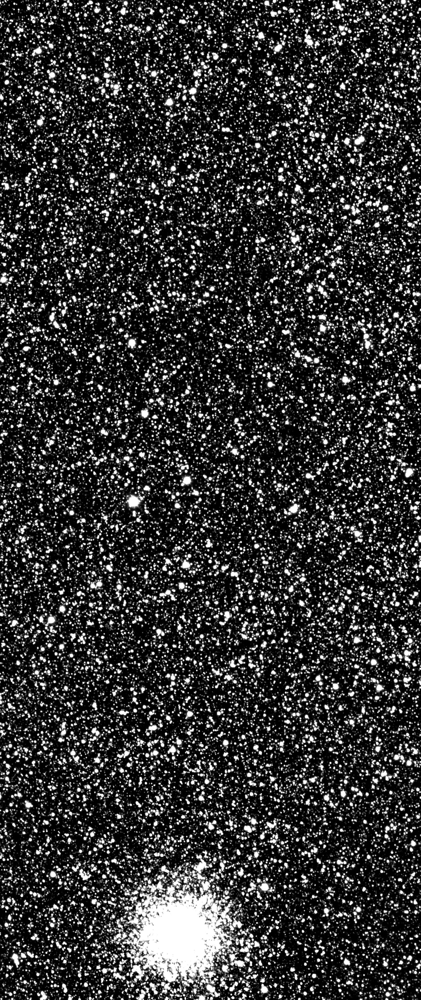
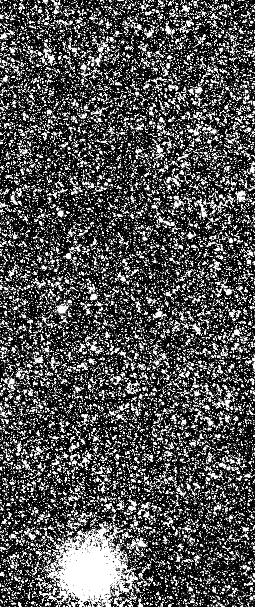

# StarsAlign - A package for aligning and comparing high density astronomical images with extreme precision

StarsAlign is a package for aligning and comparing astronomical images using the SIFT algorithm and FLANN based matcher.

It contains functions such as ```align()``` and ```diff()``` that aligns and compute the difference of two single channel images.

The package also contains ```ultra_align()``` and ```ultra_diff()``` functions for extreme precision, but they may require more resources.

This package was specifically designed to work with images that have a high amount of information, such as 4096x2048 pixels, with float32 data type, and a range of values between -155.45811 and 43314.49.

It is recommended to use the ```ultra_align()``` and ```ultra_diff()``` functions on lower resolution or lower density images, but it may result in prolonged waiting times.

Examples of this package usage can be found inside the folder examples: https://github.com/nagonzalezf/starsalign/tree/main/examples

The lastest package version is ```1.0.7.```

# Installation

Using pip:

```bash
pip install starsalign
```

Using ```setup.py``` file from root directory

```bash
python setup.py install
```
# Usage examples

Getting the aligned science image using ```align()``` function (faster method)
```
>>> import starsalign as stal
>>> aligned_image = stal.align(ref_image, science_image)
```

Getting the aligned science image with a more precise alignment using ```ultra_align()``` function (slower but more precise)
```
>>> import starsalign as stal
>>> aligned_image = stal.ultra_align(ref_image, science_image)
```
# Documentation

Documentation is under construction, in the meantime you can check:

SIFT algorithm docs at: https://docs.opencv.org/4.x/da/df5/tutorial_py_sift_intro.html

FLANN feature matcher docs at: https://docs.opencv.org/4.x/d5/d6f/tutorial_feature_flann_matcher.html

Wich are the key methods applied

# Difference Image Analysis (DIA) application examples

The main idea behind this technique is to subtract two images of the same portion of the sky, removing all photometrically stable stars, but usually this images are not aligned.

## Dataset

| Reference Image  | Science Image |
| ------------- | ------------- |
|   |   |
|   | Bridge Name: Puente Cardenal Raúl Silva Henríquez <br/><br/> Location: Maule River, Constitución, Chile <br/><br/> meter/pixel ratio: 0.68 |
|   | Bridge Name: Puente Santa Elvira <br/><br/> Location: Calle-Calle River, Valdivia, Chile <br/><br/> meter/pixel ratio: 0.35 |

